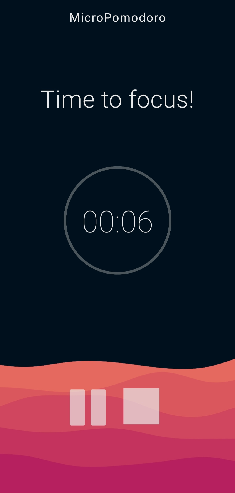

  

# MicroPomodoro
MicroPomodoro is a small & minimalistic pomodoro technique timer for Android or iOS, powered by React Native. 

# Getting started
- Fetch the repository and run the npm install.
- Install and link required packages by your package manager.
- Run the application by executing: react-native start.
